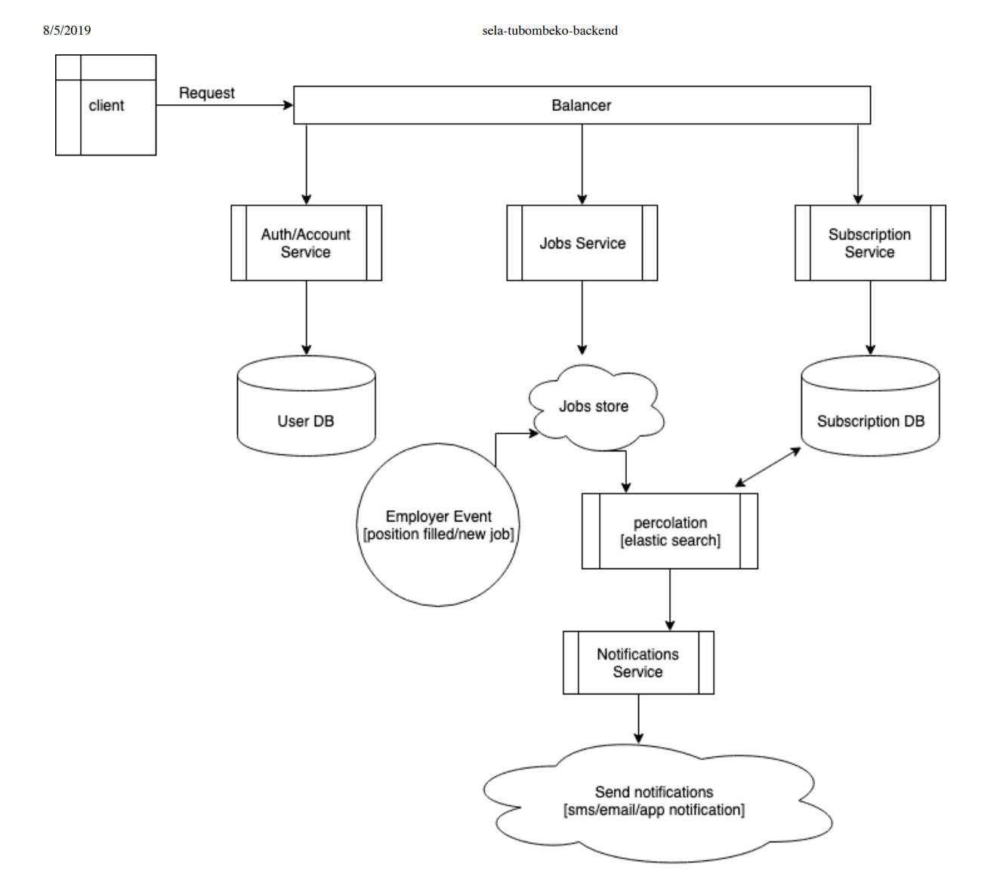

# sela-tubombeko-scalable

#  Backend
This is a rough initial design of the backend for sela-tubombeko. The vision for now is to have this serve a web app as well as a USSD app which will have limited functionality but integrated to have the essential functionality of the web app. 

Technologies: Java 

